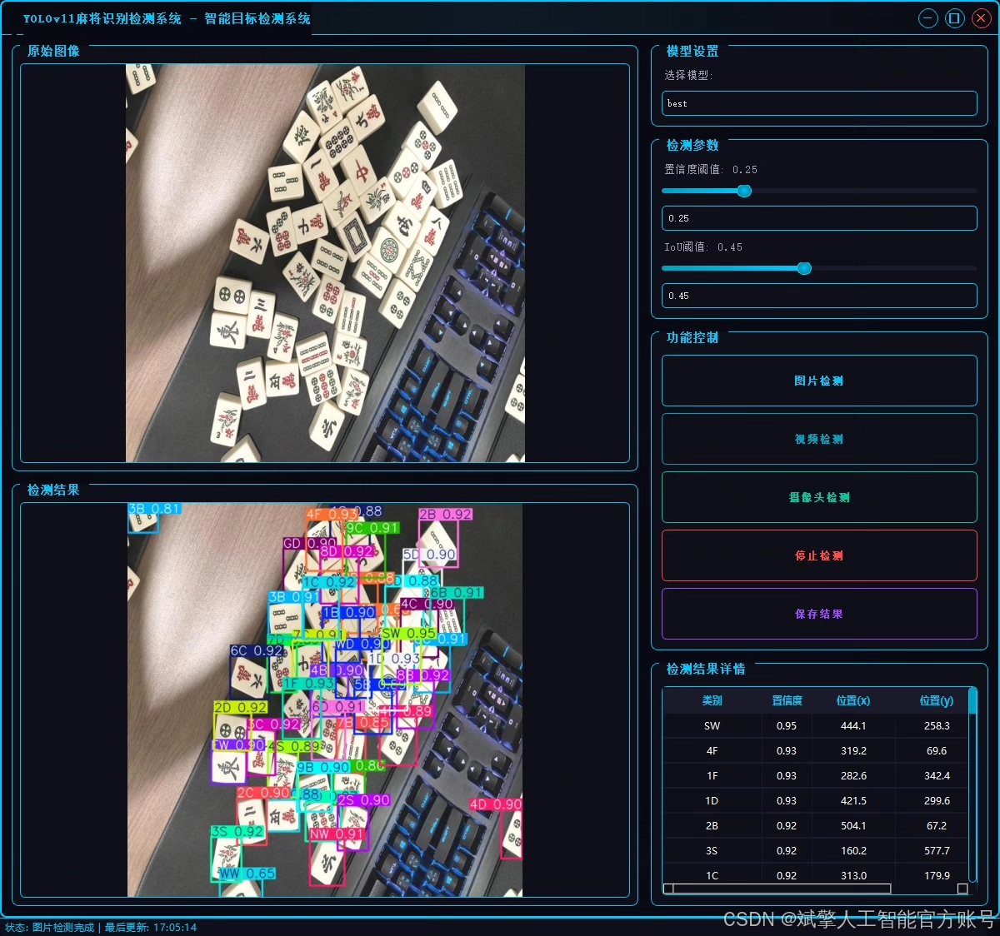
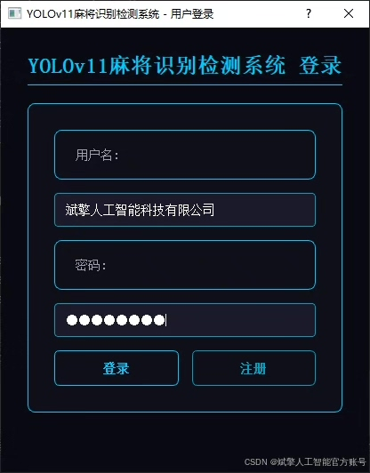
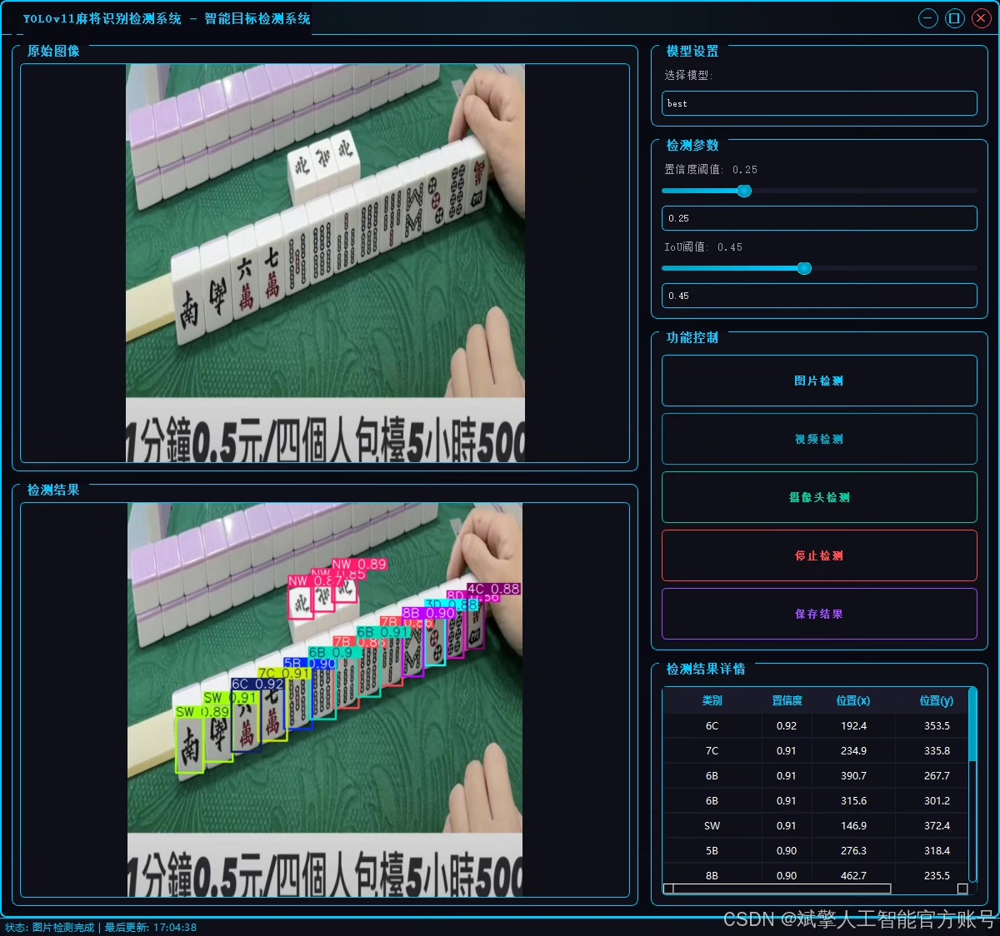
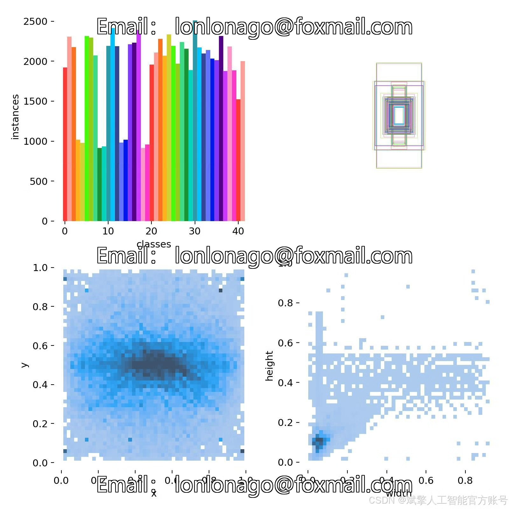
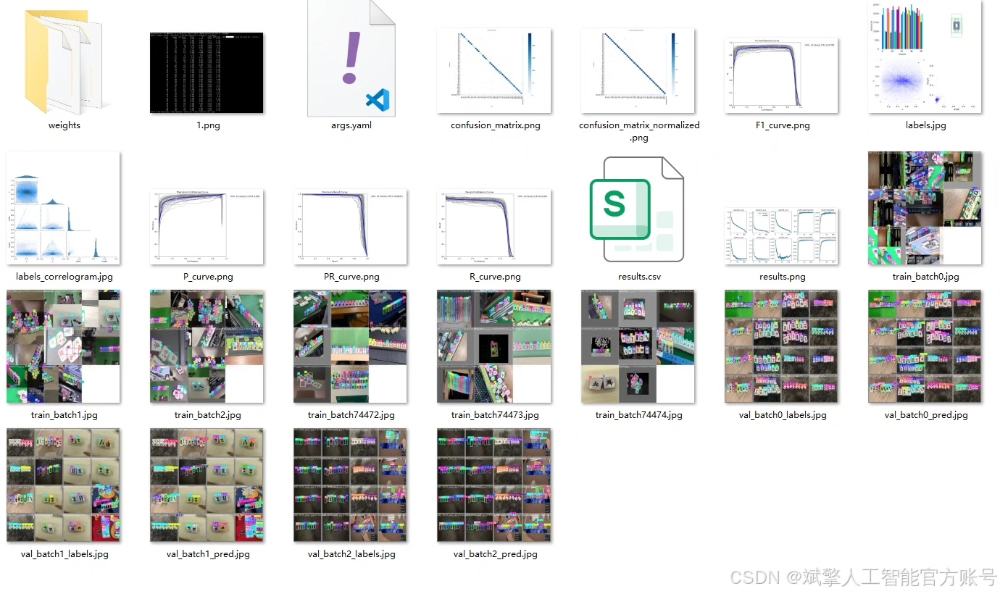
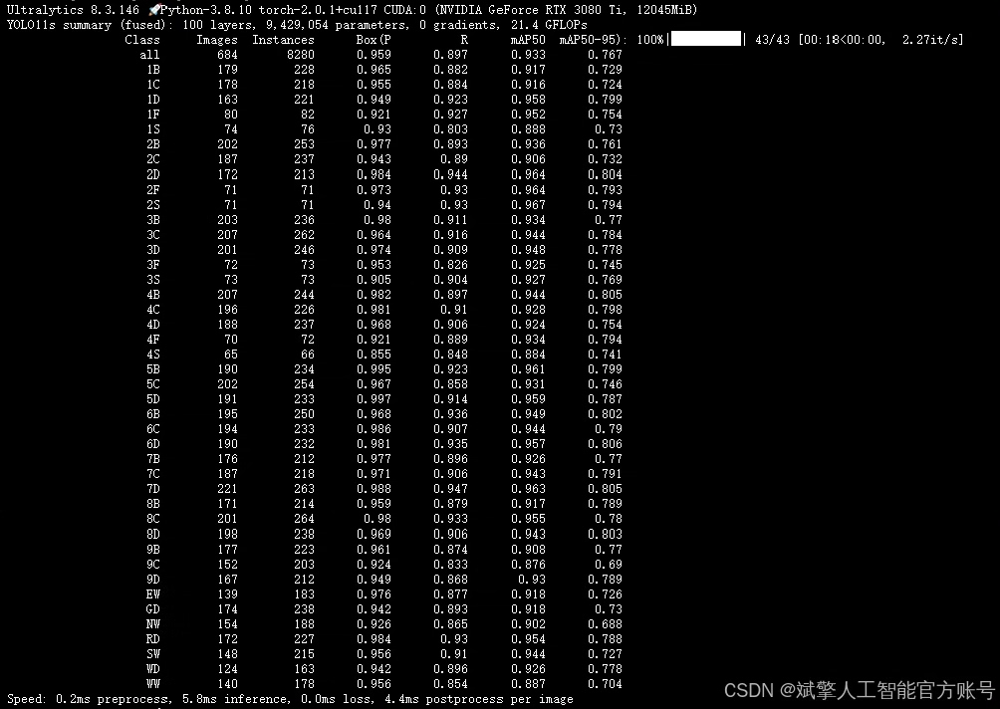
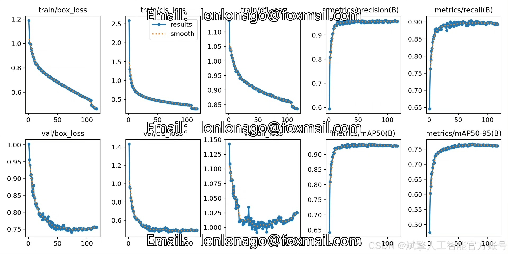
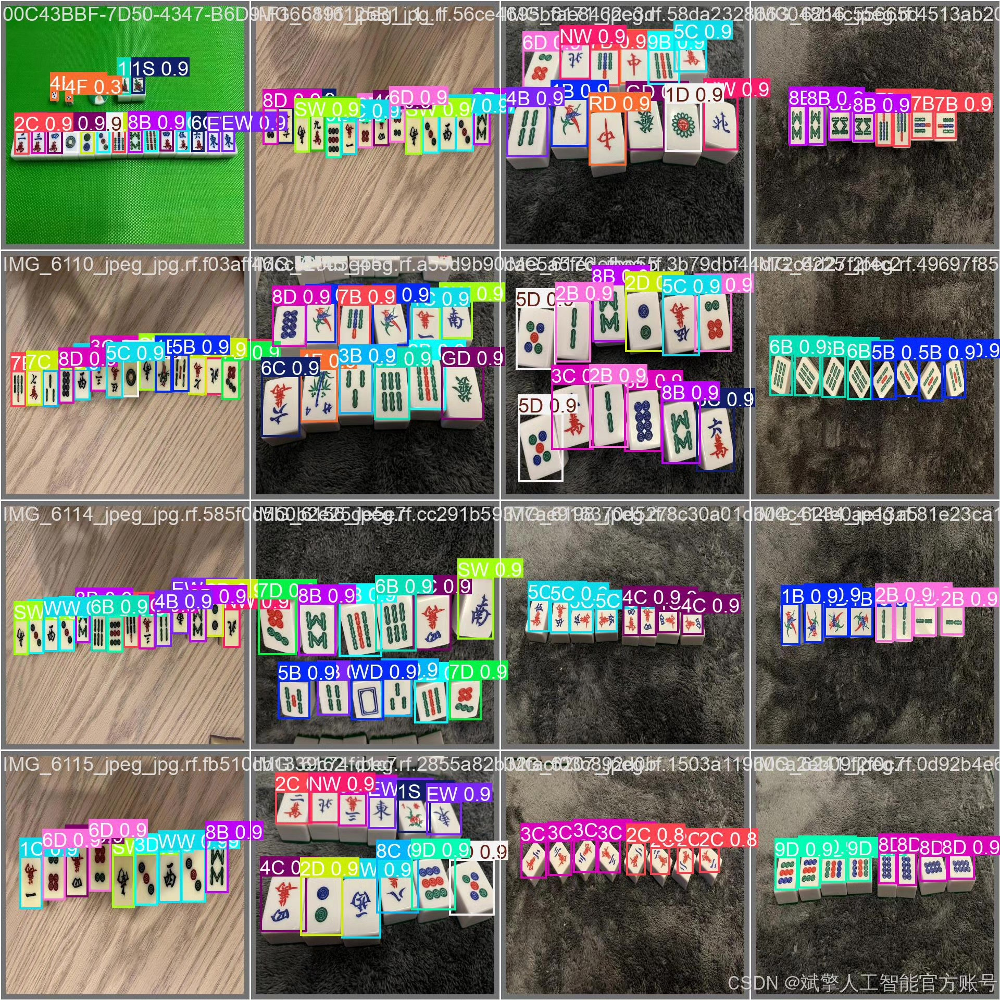
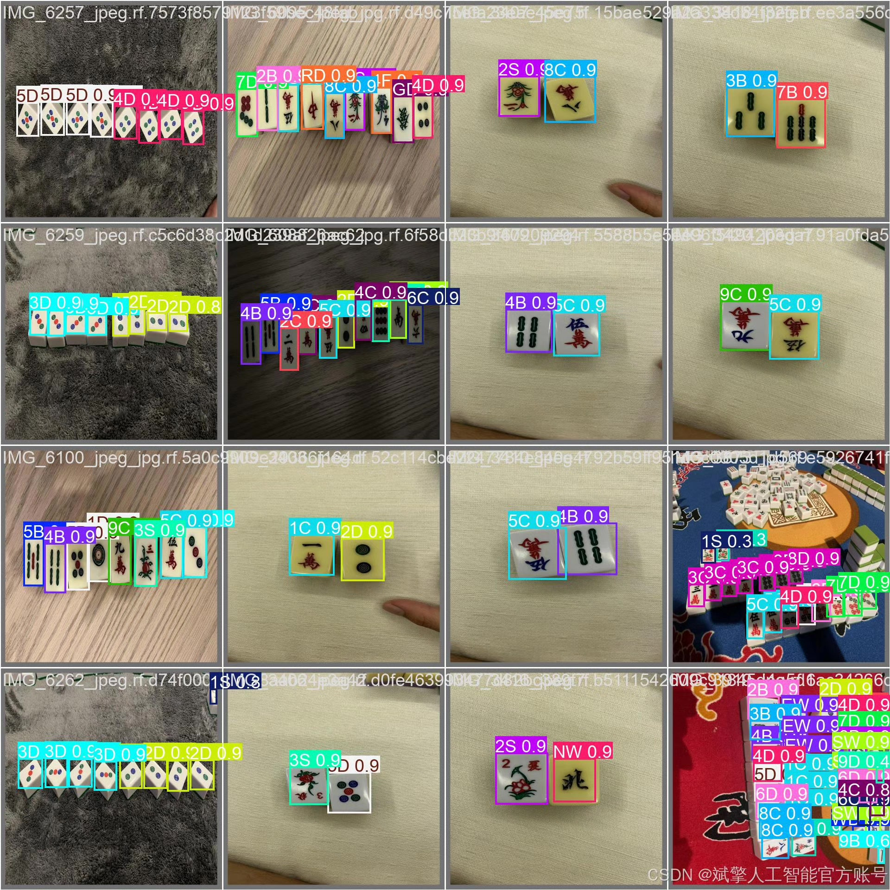

# YOLOv11 Mahjong Detection System Software Resources

## Body

YOLOv11 Mahjong Detection System Software Resources Based on Deep Learning YOLOv11: A Mahjong Card Identification and Detection System (YOLOv11+YOLO Dataset+UI Interface+Login/Registration Interface+Python Project Source Code+Model)

This paper proposes a mahjong card identification and detection system based on the YOLOv11 deep learning model, aiming to achieve efficient and accurate classification and localization of mahjong cards. The system employs an improved YOLOv11 algorithm, trained on a dataset containing 42 categories of mahjong cards (including Wan, Tang, Zhuang, Feng, and Jian cards, etc.), with a dataset size of 6,731 labeled images (5,565 training images, 684 validation images, and 482 test images). The system integrates a user-friendly UI interface, supports login/registration functions, provides complete Python project source code and pre-trained models, and offers technical support for automated mahjong games and intelligent referees in various application scenarios. Experiments show that the system achieves an mAP of 93.3% on the test set, with inference speeds below 30ms per image, demonstrating high practical value.

✅ User Login/Registration: Supports password verification and security validation.
✅ Three detection modes: Based on the YOLOv11 model, supports image, video, and real-time camera detection, accurately identifying targets.
✅ Dual-screen comparison: Displays original images and detection results simultaneously on the screen.
✅ Data visualization: Real-time table displays the category, confidence, and coordinates of detected targets.
✅ Intelligent parameter adjustment: Offers a confidence slide bar for dynamic optimization of detection accuracy, adapting to different scene requirements.
✅ Sci-fi style interactive interface: Dark theme paired with dynamic light effects, reducing visual fatigue and enhancing operational experience.

## Images

## Payment

Here is a pay link on Stripe ( https://buy.stripe.com/3cs8yP7sY87d0vu9AB ). Please contact me lonlonago@foxmail.com after funding $89, and I will send you a complete data files , thank you!

